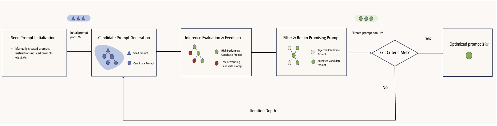

# Prompt Optimizer

Improve your prompts with any LLM using Automatic Prompt Optimization (APO).

## Overview



Automatic prompt optimization (APO) is a reinforcement learning technique to improve prompt performance.
At each iteration, new prompts are generated and scored against your AI system using your validation set.
Promising prompts are kept and used to seed the next generation of prompts.
The goal is to find the prompt that maximizes the AI system's performance on the evaluation metric you define.

## Installation

**uv (recommended)**

```sh
uv add git+https://github.com/taagarwa-rh/prompt-optimizer.git
```

## Usage

See [the docs](https://taagarwa-rh.github.io/prompt-optimizer/) for information on package usage.

## Roadmap

- [ ] Add prepackaged pipelines and metrics

## Citations

```
@inproceedings{Ramnath_2025,
   title={A Systematic Survey of Automatic Prompt Optimization Techniques},
   url={http://dx.doi.org/10.18653/v1/2025.emnlp-main.1681},
   DOI={10.18653/v1/2025.emnlp-main.1681},
   booktitle={Proceedings of the 2025 Conference on Empirical Methods in Natural Language Processing},
   publisher={Association for Computational Linguistics},
   author={Ramnath, Kiran and Zhou, Kang and Guan, Sheng and Mishra, Soumya Smruti and Qi, Xuan and Shen, Zhengyuan and Wang, Shuai and Woo, Sangmin and Jeoung, Sullam and Wang, Yawei and Wang, Haozhu and Ding, Han and Lu, Yuzhe and Xu, Zhichao and Zhou, Yun and Srinivasan, Balasubramaniam and Yan, Qiaojing and Chen, Yueyan and Ding, Haibo and Xu, Panpan and Cheong, Lin Lee},
   year={2025},
   pages={33066–33098} }
```
