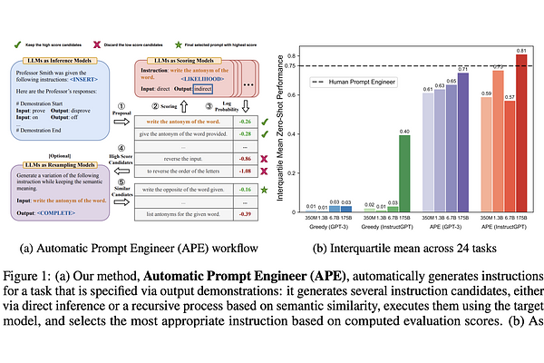

# Automatic Prompt Engineer (APE)

## About



Automatic Prompt Engineer (APE) starts by generating a set of prompt candidates through "forward generation".
During forward generation, input and output pairs from the validation set are presented to the language model, and the model is tasked with generating the instructions that could be used to answer that question.
After these initial prompts are scored, the top k% scoring prompts are retained.
On the following iterations, these prompts are resampled by asking a language model to create a variation of an existing prompt, then scoring and selecting the top k% scoring prompts.
This process continues until the maximum iteration depth is reached or the score threshold is exceeded.

## Citation

```
@misc{zhou2023largelanguagemodelshumanlevel,
    title={Large Language Models Are Human-Level Prompt Engineers}, 
    author={Yongchao Zhou and Andrei Ioan Muresanu and Ziwen Han and Keiran Paster and Silviu Pitis and Harris Chan and Jimmy Ba},
    year={2023},
    eprint={2211.01910},
    archivePrefix={arXiv},
    primaryClass={cs.LG},
    url={https://arxiv.org/abs/2211.01910}, 
}
```

## Source

::: src.prompt_optimizer.optimizers.ape
    options:
      heading_level: 2