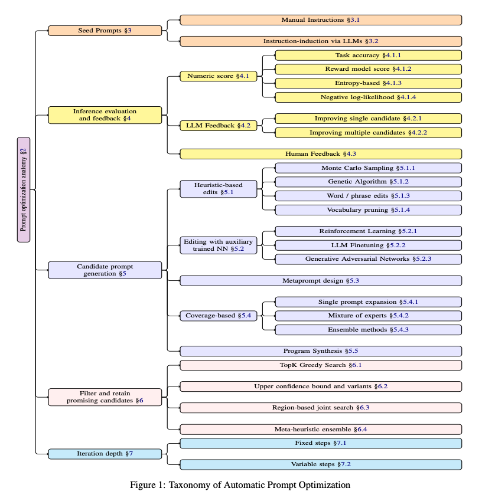

# Overview

Automatic prompt optimization (APO) is a reinforcement learning technique used to improve task performance for AI language models.
There are dozens of APO algorithms that can accomplish this task, but most all of them follow five general steps (Ramnath, et. al. 2025):

1. Seed Prompt Initialization - Using manually created prompts or instruction-induced prompts via LLMs
2. Candidate Prompt Generation - Generating new instruction prompts based on the previous generation of prompts
3. Inference Evaluation & Feedback - Evaluate the performance of new prompts using a validation set and provide feedback to the APO algorithm
4. Filter & Retain Promising Prompts - Select prompts to seed the next generation
5. Repeat steps 2-4 until the exit criteria is met

Each algorithm implements these five steps differently.
For example, while most algorithms use a user-provided seed prompt in the first step, APE generates seed prompts by inferring instructions from task input-output pairs.
This makes it useful for instances where the task may be unknown or hard to describe, but it struggles when there are non-obvious conditions or constraints on the prompt output.

As another example, while some algorithms like APE and OPRO use random input-output pairs from the validation set to generate new prompts, algorithms like PromptAgent and ProTeGi sample from the input-output pairs that the prompt failed on when generating new prompts.
This means the prompts from these algorithms should get progressively better with each iteration as they learn from the mistakes they made.

The next section covers these differences in more detail for the algorithms implemented in this package.

## Comparison of Algorithms

<table>
    <tr>
        <th>Step</th>
        <th>APE</th>
        <th>OPRO</th>
        <th>ProTeGi</th>
        <th>PromptAgent</th>
    </tr>
    <tr>
        <td>Seed Prompt Initialization</td>
        <td><li>Generate multiple seed prompts using samples from the validation set</li></td>
        <td><li>Use a user-provided seed prompt</li></td>
        <td><li>Use a user-provided seed prompt</li><li>Collect inference errors</li></td>
        <td><li>Use a user-provided seed prompt</li><li>Collect inference errors</li></td>
    </tr>
    <tr>
        <td>Candidate Prompt Generation</td>
        <td><li>Generate variations of previous prompts</li></td>
        <td><li>Generate new prompts using scored prompt candidates and a random sample from the validation set</li><li>Scored prompts are sorted by score to demonstrate a prompt trajectory</li></td>
        <td><li>Generate error feedback</li><li>Generate new prompts using the generated feedback</li></td>
        <td><li>Generate error feedback</li><li>Get prompt trajectory along branch</li><li>Generate new prompts using the prompt trajectory and generated feedback</li></td>
    </tr>
    <tr>
        <td>Inference Evaluation & Feedback</td>
        <td><li>Score the new prompts against the validation set</li></td>
        <td><li>Score the new prompts against the validation set</li></td>
        <td><li>Score the new prompts against the validation set</li><li>Collect inference errors</li></td>
        <td><li>Score the new prompts against the validation set</li><li>Collect inference errors</li></td>
    </tr>
    <tr>
        <td>Filter & Retain Promising Prompts</td>
        <td><li>Select and keep the top k_percent of prompts for the next generation</li></td>
        <td><li>Keep all prompts for the next generation</li></td>
        <td><li>Beam: Keep only the best prompt</li><li>Greedy: Keep all prompts</li></td>
        <td><li>Beam: Keep the best prompt from each branch</li><li>Greedy: Keep all prompts</li></td>
    </tr>
    <tr>
        <td>Exit Criteria</td>
        <td><li>Score exceeds score threshold, or</li><li>Maximum iterations are reached</li></td>
        <td><li>Score exceeds score threshold, or</li><li>Maximum iterations are reached</li></td>
        <td><li>Score exceeds score threshold, or</li><li>Maximum iterations are reached</li></td>
        <td><li>Score exceeds score threshold, or</li><li>Maximum iterations are reached</li></td>
    </tr>
</table>
